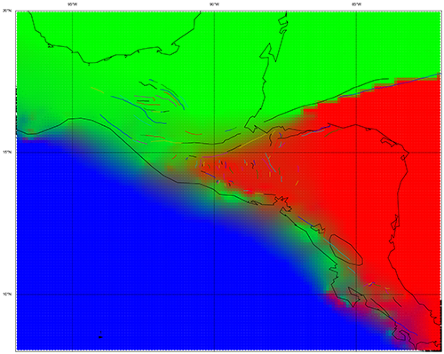

Partial Plates
==============

An alternative to microplate formulations of tectonic geodesy.

### Introduction
In areas of distributed deformation, the rigid plate model of
tectonics appears to break down, or at least become insufficient for completely
describing deformation. This has driven many workers towards increasing the
number of small plates, microplates, or 'blocks' in an orogen. These
microplates represent geodetically cohesive regions of the crust that are
completely bounded and defined by faults, and have minimal internal
deformation (possibly some amount of homogeneous strain).

This is not always consistent with observations of faults in deformation zones:
Faults tend not to connect with other faults on the surface, and definitely do
not completely encompass and separate internally-rigid rotating blocks.

Instead, the decadal velocity field in many deforming regions seems to be
transitional in between the velocity fields of the major tectonic plates that
surround an orogen. Within the deformation zone, the velocity vectors can be
constructed as the sum of partial plate velocity vectors:

> Vsite = C1 * Vplate1 + C2 * Vplate2

For example, the velocity of a GPS site in northern Honduras near the North
American-Caribbean plate boundary may be moving 40% with North America and
60% with the Caribbean plates. Near triple junctions, a site may be
'influenced' by 3 plates.

By defining site velocities in terms of 'partial plates', or coefficients of
rigid macroplate motion, we can accomplish several things:

1. *Redefine strain as changes in plate coefficients:* Even though a velocity
   gradient exists between any two points on a rotating plate (i.e. the east or
   north velocities will change even if the magnitude does not), as long as
   those points are moving with the plate, there is no strain between them.
   However, changes in plate coefficients (e.g. C1 in the above equation)
   indicate that strain is occurring. Changes in coefficents along a radius
   (from the Euler pole) indicate simple shear (i.e. strike-slip faulting),
   while changes along a circumference indicate pure shear (shortening or
   extension). The sum of coefficient changes from all plates involved is the
   total strain in the region (it is possible that some changes will cancel
   out).

2. *Calculate fault slip rates independently of block motion*: In block models,
   the self-consistency constraints necessitate that the relative motion
   between any two adjacent blocks is completely taken up by slip on the
   intervening fault. However, by modeling a site velocity as a sum of partial
   plate velocities, 

3. *Identify areas of anomalous or independent motion:*
   

### Aims

### Scope

### Progress
